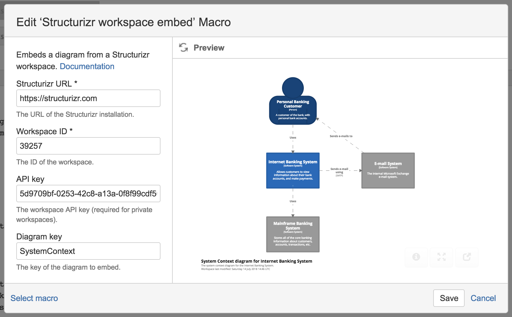

# Structurizr macros for Atlassian Confluence Server

This repository contains the source code for a macro that embeds diagrams from a Structurizr workspace into Confluence on Atlassian Confluence Server.

With Atlassian discontinuing Confluence Server, this repo (and the macro) is now unsupported, and will receive no updates.
Please also note that there is no version of this macro for installation on Confluence Data Center,
predominantly due to the non-trivial certification process that plugins need to go through.

## Usage

The macros can be installed via the <a href="https://marketplace.atlassian.com/vendors/1213399">Atlassian Marketplace</a>, and are available for both Confluence Cloud and Server.
When editing a page, type <code>{structurizr</code> or <code>/structurizr</code> (depending on the Confluence version) to insert the macro into your page.
You will need the following information:

- Workspace ID
- Workspace API key (from the workspace settings page)
- Diagram key (this is shown after the `#` symbol when viewing a diagram)

Please note that diagram previews do not always display - you may need to save/publish the page.



## Prebuilt releases

 - [v2.2.0](https://github.com/structurizr/atlassian-confluence-server/releases/tag/v2.2.0)
 
 ## Building from source
 
To build the macro from the source, you will need:
 
  - [Java 8 SDK](https://www.oracle.com/technetwork/java/javase/downloads/jdk8-downloads-2133151.html)
  - [Atlassian Plugin SDK](https://developer.atlassian.com/server/framework/atlassian-sdk/downloads/)
  
You will then need to setup your build environment; for example:
  
```
export JAVA_HOME=/jdk1.8.0_201.jdk
export ATLASSIAN_HOME=/atlassian-plugin-sdk-8.0.16/
export PATH=$ATLASSIAN_HOME/bin/:$PATH
```

And to build:

```
atlas-mvn package
```

If successful, you will see a file called ```structurizr-confluence-x.y.z.jar``` in the ```target``` directory.